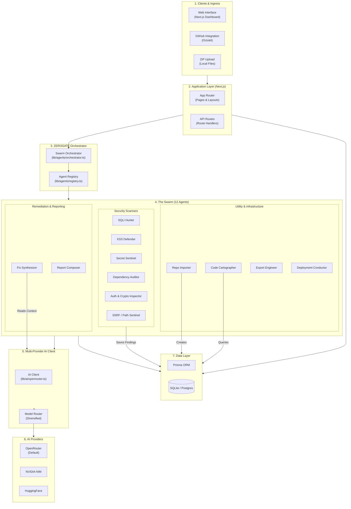
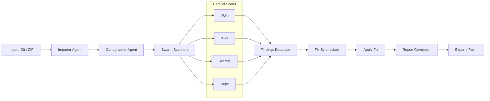

<div align="center">
  
</div>


# ZEROGATE — Autonomous Security Swarm

> **The autonomous security swarm for your codebase. A market-ready, multi-agent AI platform that scans, explains, and remediates vulnerabilities in software projects.**

[](https://zerogate1.vercel.app/)
[](LICENSE)
[](https://nextjs.org/)
[](https://www.typescriptlang.org/)

🌐 **Live demo Video:** [Youtube](https://youtu.be/tgkze7UH0CY) 
   **Website:** [Zerogate Platform](https://zerogate1.vercel.app/)

<div align="center">
  <a href="https://youtu.be/tgkze7UH0CY">
    
  </a>
</div>

---

## 📖 Table of Contents
1. [Overview](#-overview)
2. [Core Features](#-core-features)
3. [System Architecture](#-system-architecture)
4. [The 12 Specialized Agents](#-the-12-specialized-agents)
5. [AI Models & Providers](#-ai-models--providers)
6. [Data Flow Pipeline](#-data-flow-pipeline)
7. [Tech Stack](#-tech-stack)
8. [Getting Started](#-getting-started)
9. [License](#-license)

---

## 🔍 Overview

**ZEROGATE** is a multi-agent AI platform designed to autonomously handle the security lifecycle of a codebase. It supports ingestion via GitHub repositories, forks, or ZIP uploads. Once ingested, a swarm of **12 specialized agents** takes over to map the code, scan for vulnerabilities (using both static analysis and AI), synthesize fixes, and generate executive reports.

This project is a standalone Next.js application, making it lightweight and easy to deploy, while still offering enterprise-grade AI analysis via a multi-provider setup across **OpenRouter, NVIDIA NIM, and HuggingFace**.

👉 **Try it now:** [https://zerogate1.vercel.app/](https://zerogate1.vercel.app/)

---

## ✨ Core Features

- **Autonomous Swarm**: 12 agents working in harmony, each with a specific security or utility role.
- **Multi-Provider AI**: Live routing across **OpenRouter, NVIDIA NIM, and HuggingFace** — each agent uses the model best suited to its task (see [AI Models & Providers](#-ai-models--providers)).
- **Hybrid Scanning**: Combines fast, deterministic static analysis (SAST) with deep LLM reasoning for zero-day and complex vulnerability detection.
- **Context-Aware Fixes**: The *Fix Synthesizer* agent (Qwen3-Coder 480B on NVIDIA NIM) produces small `before` → `after` patches with rationale, automatically retrying with self-feedback if a response is degenerate.
- **Resilient AI Layer**: Every model call is wrapped with a 75s timeout, transient-error retries (429 / 5xx / network), and mock fallbacks — a flaky provider will never hard-fail the UI.
- **GitHub-Native Workflow**: Import any repo, run the swarm, and push fixes back as a branch / PR in one click.
- **Plan-Gated Capabilities**: Features are structured into Free, Pro, and Max tiers (INR billing), gated by the orchestrator.

---

## 🏗 System Architecture

The following block diagram illustrates the complete architecture of the ZEROGATE platform, showing "each and every bit" of the interaction between the orchestrator, agents, databases, and AI providers.



---

## 🤖 The 12 Specialized Agents

ZEROGATE utilizes a specialized swarm where each agent has a specific task and is pinned to a designated AI model. Routing is configured via per-agent `MODEL_*` environment variables in `.env` (see [`src/lib/ai/openrouter.ts`](src/lib/ai/openrouter.ts) for defaults and [`src/lib/agents/orchestrator.ts`](src/lib/agents/orchestrator.ts) for the `AGENT_MODEL_MAP`).

| # | Agent | Model | Provider | Responsibility |
| :-: | :--- | :--- | :--- | :--- |
| 1 | **Repo Importer** | *Deterministic (Octokit)* | — | Pulls GitHub repos, handles forks & ZIP uploads, normalizes file metadata and language detection. |
| 2 | **Code Cartographer** | `openai/gpt-oss-120b:free` | OpenRouter | Indexes every file, infers the stack, and flags critical attack surfaces. |
| 3 | **SQLi Hunter** | `openai/gpt-oss-120b:free` | OpenRouter | Multi-language tainted-source SAST + LLM reasoning for SQL Injection. |
| 4 | **XSS Defender** | `nvidia/llama-3.3-nemotron-super-49b-v1` | NVIDIA NIM | Scans for DOM, template, and SSR Cross-Site Scripting vulnerabilities. |
| 5 | **Secret Sentinel** | `Qwen/Qwen3-235B-A22B` | HuggingFace | Provider-specific pattern and entropy-based secret detection. |
| 6 | **Dependency Auditor** | `Qwen/Qwen3-235B-A22B` | HuggingFace | Matches `package.json` / `requirements.txt` against known CVE databases. |
| 7 | **Auth & Crypto Inspector** | `meta/llama-3.3-70b-instruct` | NVIDIA NIM | Inspects JWT usage, password hashing, and weak cryptography primitives. |
| 8 | **SSRF / Path Sentinel** | `nvidia/nemotron-3-super-120b-a12b:free` | OpenRouter | Scans for Server-Side Request Forgery and Path Traversal sinks. |
| 9 | **Fix Synthesizer** | `qwen/qwen3-coder-480b-a35b-instruct` | NVIDIA NIM | Produces minimal `before` → `after` patches with rationale; auto-retries on no-op responses. |
| 10 | **Report Composer** | `openai/gpt-oss-120b:free` | OpenRouter | Compiles findings into a professional Markdown executive report. |
| 11 | **Export Engineer** | *Deterministic* | — | Generates CSV, styled XLSX, and project ZIP exports. |
| 12 | **Deployment Conductor** | *Deterministic (Octokit)* | — | Commits patched files back to a fix branch and opens a pull request on GitHub. |

---

## 🧠 AI Models & Providers

ZEROGATE does **not** rely on a single model. The multi-provider AI client ([`src/lib/ai/openrouter.ts`](src/lib/ai/openrouter.ts)) routes each request to the provider best suited for the agent's task, using an OpenAI-compatible `/chat/completions` contract across all three backends.

### Supported Providers

| Provider | Role | Base URL |
| :--- | :--- | :--- |
| **OpenRouter** | Primary gateway for free open-source MoE / reasoning models. | `https://openrouter.ai/api/v1` |
| **NVIDIA NIM** | High-throughput inference for code generation and large-context reasoning. | `https://integrate.api.nvidia.com/v1` |
| **HuggingFace** | Serverless inference for pattern/entropy work and broad-knowledge queries. | `https://router.huggingface.co/v1` |

### Models Currently In Production

| Model | Provider | Used By |
| :--- | :--- | :--- |
| **GPT-OSS 120B** (`openai/gpt-oss-120b:free`) | OpenRouter | Code Cartographer, SQLi Hunter, Report Composer, default reasoning |
| **Nemotron-3 Super 120B** (`nvidia/nemotron-3-super-120b-a12b:free`) | OpenRouter | SSRF / Path Sentinel |
| **Qwen3-Coder 480B** (`qwen/qwen3-coder-480b-a35b-instruct`) | NVIDIA NIM | **Fix Synthesizer**, default code model |
| **Llama-3.3 Nemotron Super 49B** (`nvidia/llama-3.3-nemotron-super-49b-v1`) | NVIDIA NIM | XSS Defender |
| **Llama-3.3 70B Instruct** (`meta/llama-3.3-70b-instruct`) | NVIDIA NIM | Auth & Crypto Inspector |
| **Qwen3-235B MoE** (`Qwen/Qwen3-235B-A22B`) | HuggingFace | Secret Sentinel, Dependency Auditor, default "fast" path |

### Resilience

Every model call goes through a resilient wrapper (`aiCompleteResilient` in `orchestrator.ts`) with:

- 75-second per-attempt timeout via `AbortController`
- Automatic retry on transient errors (`429`, `5xx`, `AbortError`, `ECONNRESET`, `ETIMEDOUT`)
- Cross-provider fallback — if a provider key is missing, the call falls back to OpenRouter before dropping to a mock response
- Self-feedback retry on degenerate fix outputs (no-op, empty `before`/`after`, unparseable JSON)

---

## 🔄 Data Flow Pipeline



---

## 🛠 Tech Stack

- **Framework**: Next.js 14 (App Router, Server Components, Route Handlers)
- **Language**: TypeScript 5
- **Database ORM**: Prisma
- **Database**: SQLite for dev, Postgres for production (Prisma Accelerate / Vercel Postgres)
- **AI Integration**: Custom multi-provider client with OpenAI-compatible routing across OpenRouter, NVIDIA NIM, and HuggingFace
- **Auth**: NextAuth (Credentials + GitHub OAuth)
- **GitHub**: Octokit for repo import, branch creation, and PR automation
- **Hosting**: Deployed on [Vercel](https://zerogate1.vercel.app/)

---

## ⚙️ Getting Started

> Prefer to skip setup? The hosted build is live at **[zerogate1.vercel.app](https://zerogate1.vercel.app/)**.

### 1. Installation
```bash
npm install
```

### 2. Environment Setup
Copy the example environment file:
```bash
cp .env.example .env
```

Required keys:
- `NEXTAUTH_SECRET` — generate with `openssl rand -base64 32`
- `DATABASE_URL` — SQLite path for dev, Postgres URL for prod

At least one AI provider key (the client auto-falls-back to OpenRouter if an agent's assigned provider key is missing):
- `OPENROUTER_API_KEY` — recommended primary, covers the most agents
- `NVIDIA_API_KEY` — required for Fix Synthesizer, XSS Defender, Auth & Crypto Inspector
- `HF_TOKEN` — required for Secret Sentinel and Dependency Auditor

Optional (enables GitHub import + PR workflow):
- `GITHUB_CLIENT_ID` / `GITHUB_CLIENT_SECRET` — OAuth app credentials
- `GITHUB_DEFAULT_TOKEN` — PAT with `repo` scope for org-wide fallback

Per-agent model overrides (all optional, defaults live in `src/lib/ai/openrouter.ts`):
- `MODEL_FIX_SYNTHESIZER`, `MODEL_SQLI_HUNTER`, `MODEL_XSS_DEFENDER`, `MODEL_SECRET_SENTINEL`,
  `MODEL_AUTH_CRYPTO`, `MODEL_SSRF_PATH`, `MODEL_DEPENDENCY_AUDITOR`
- `MODEL_REASONING`, `MODEL_CODE`, `MODEL_FAST` (utility defaults)

### 3. Database Setup
```bash
npx prisma db push
```

### 4. Run Development Server
```bash
npm run dev
```
Open `http://localhost:3000` in your browser — or head straight to the [live deployment](https://zerogate1.vercel.app/).

---

## 📄 License
Proprietary — © ZEROGATE Labs. Contact for evaluation, OEM, and on-prem licensing.

---

<div align="center">
  <strong>🌐 <a href="https://zerogate1.vercel.app/">zerogate1.vercel.app</a></strong>
</div>
